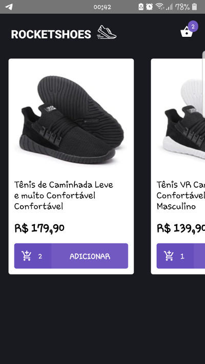
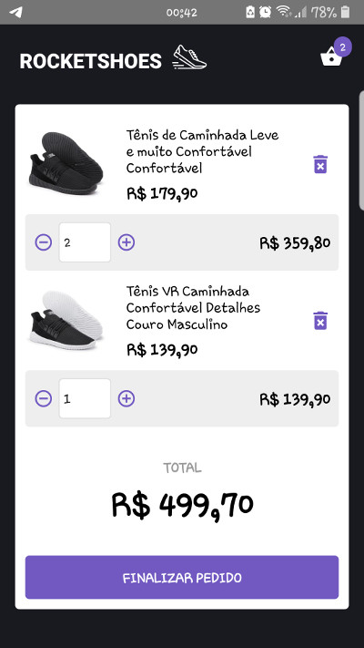
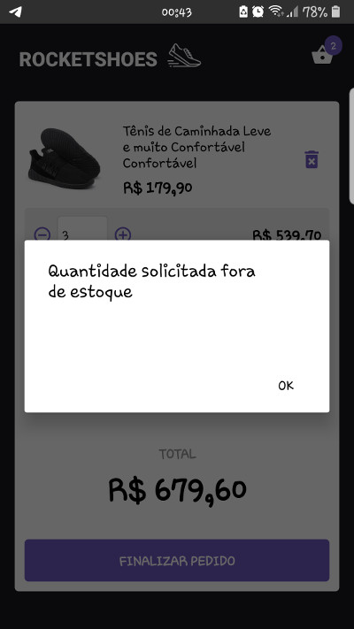

<h1 align="center">
    
</h1>

<h3 align="center">
  Desafio 7: Arquitetura Flux no React Native
</h3>

<blockquote align="center">“Não espere resultados brilhantes se suas metas não forem claras!”</blockquote>

  

  

  

## :rocket: Sobre o projeto

- Um aplicativo mobile utilizando [React Native](https://facebook.github.io/react-native/) que simula um carrinho de compras de um e-commerce.

## :mortar_board: Bootcamp - Desafio 7

### Ferramentas e conceitos utilizados

- [ESLint](https://eslint.org/), [Prettier](https://prettier.io/) & [EditorConfig](https://editorconfig.org/)
- [Reactotron](https://github.com/infinitered/reactotron)
- [React Navigation](https://github.com/react-navigation/react-navigation)
- [React Native Vector Icons](https://github.com/oblador/react-native-vector-icons)
- [Json Server](https://github.com/typicode/json-server) e utilização do [Axios](https://github.com/axios/axios)
- [Polished](https://github.com/styled-components/polished)
- [Redux](https://redux.js.org/), [Redux Saga](https://github.com/redux-saga/redux-saga), [Immer](https://github.com/immerjs/immer) e utilização com [Reactotron](https://github.com/infinitered/reactotron)

### Funcionalidades

- Adicionar produtos ao carrinho;
- Remover produtos do carrinho;
- Controle de estoque;
- Utilizando Redux e Redux Saga para controlar e mostrar a quantidade;
- Cálculos automatizados no carrinho;

## :computer: Resultado do desafio

### Listagem de produtos

### Página do Carrinho

### Alerta do controle de estoque

## :memo: Licença

Esse projeto está sob a licença MIT. Veja o arquivo [LICENSE](LICENSE.md) para mais detalhes.

---

Desafio realizado por Alley M. Carvalho
